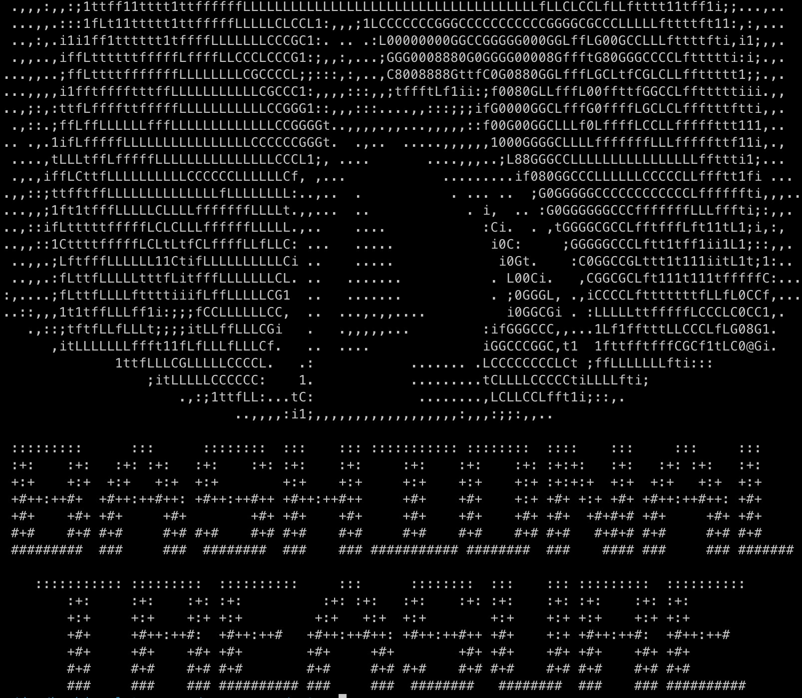

# Bashional Treasure

Welcome to Bashional Treasure, the best command line treasure hunting game to ever teach you about the bash shell! Learn the lore surrounding the Templar Treasure and its secrets hidden throughout American and world history. Search for clues and solve riddles as you search for treasure and gain knowledge. Watch your back! You may not be the only one searching for the treasure...

### Getting Started

First, download the game. To run the game, use the command `./run_me_to_start.sh`. This command only needs to be run once. From this point on, you will play by entering level directories.

### Gameplay

All gameplay takes place in the shell. This game is compatible with MacOS and Linux distributions that have the bash shell. You may also be able to play this game using WSL on Windows, but this has not been tested. This game does not have to be played all at once to function properly. All necessary game data is stored in files on your system. This game is currently only designed to be played once and does not ship with a restart script. Upon completing levels, move back to the root directory of the game and start the next level. Enjoy!

### Acknowledgements

* This game was developed by Gunnar Sundberg
* Storyline is based on the National Treasure movie
* Some dialogue is from the National Treasure script
* All character art generated using https://ascii.co.uk/image2ascii
* Cover art image generated using https://ascii.co.uk/image2ascii
* Cover art text generated using https://www.coolgenerator.com/ascii-text-generator
* All styled text generated using https://www.coolgenerator.com/ascii-text-generator
* Explosion art: https://www.asciiart.eu/weapons/explosives
* Treasure art: https://ascii.co.uk/art/treasure

